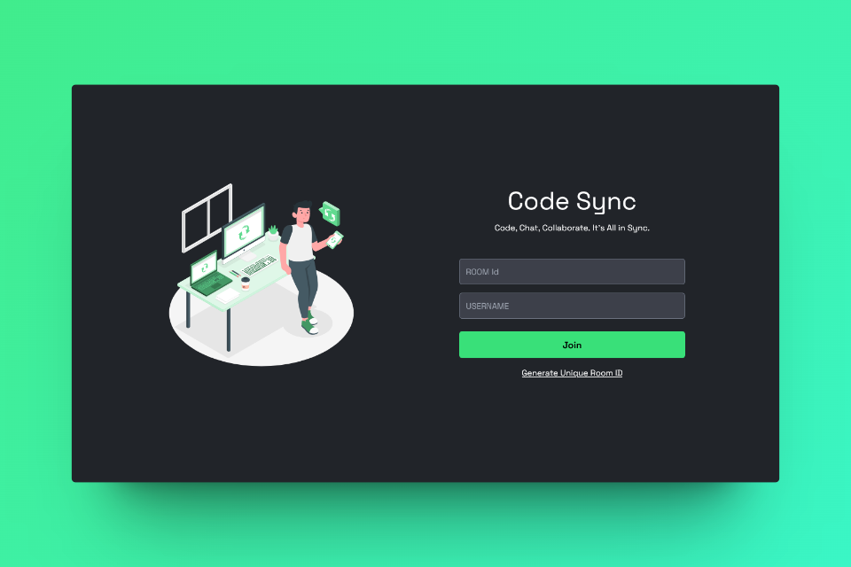

# Code Sync - A Realtime Code Editor



Code Sync is a collaborative, real-time code editor where users can seamlessly code together. It provides a platform for multiple users to enter a room, share a unique room ID, and collaborate on code simultaneously.

## 🔮 Features

- 💻 Real-time collaboration on code editing across multiple files
- 📁 Open, edit, save, and delete file functionalities
- 💾 Option to download files edited within the collaboration session
- 🚀 Unique room generation with room ID for collaboration
- 🌍 Comprehensive language support for versatile programming

<!-- ## 🚀 Live Preview -->

<!-- You can view the live preview of the project [here](https://code-sync-live.vercel.app/). -->

## 💻 Tech Stack


## ⚙️ Installation

1. **Fork this repository:** Click the Fork button located in the top-right corner of this page to fork the repository.
2. **Clone the repository:**
   ```bash
   git clone https://github.com/<your-username>/Code-Sync.git
   ```
3. **Set .env file:**
   Inside the client and server directories rename the `.env.example` file to `.env` and set the following environment variables:

   Frontend:

   ```bash
   VITE_BACKEND_URL=<your_server_url>
   ```

   Backend:

   ```bash
   PORT=3000
   ```

4. **Install dependencies:**
   Navigate to the frontend and backend directories separately and run:
   ```bash
    npm install
   ```
5. **Start the frontend and backend servers:**  
   Frontend:
   ```bash
   cd client
   npm run dev
   ```
   Backend:
   ```bash
   cd server
   npm run dev
   ```
6. **Access the application:**
   Open a browser and enter the following URL:
   ```bash
   http://localhost:5173/
   ```

## 🔮 Features for next release

- **Admin Permission:** Implement an admin permission system to manage user access levels and control over certain platform features.

## 🤝 Contribute

We welcome contributions to make Code Sync even better! Whether you're reporting a bug, suggesting a new feature, or fixing a typo, your input is valuable to us. Follow the [contribution guidelines](CONTRIBUTING.md) to get started.

## 🌟 Support Us

If you find this helpful or valuable, please consider 🌟 starring the repository. It helps us gain visibility and encourages further development. We appreciate your support!

## 🧾 License

This project is licensed under the [MIT License](LICENSE).
